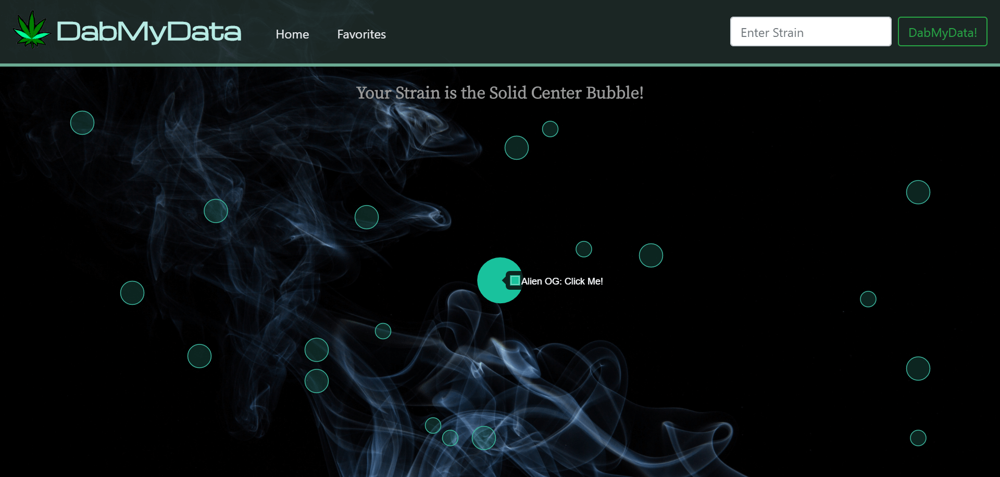

# DabMyData

## Cannabis Exploration Website

This application allows users to search for information about specific cannabis strains while also exploring new strains. There is an age-gate modal upon entering the site that uses session storage as well as Moment.js to determine if the age entered is 21 or above. Once in the site, the user can enter a strain into the search bar. A datalist containing around 2,000 strains is dynamically appended to the searchbar from Firebase to help the user find strains. After a user searches for a strain, we use "The Strain" API to pull information about that specific strain as well as 19 other random strains. These 20 strains are then appended to the page using Chart.js as a bubble chart. The searched strain is always the center bubble and the other 19 are in random locations. If a user clicks on any strain, a modal will pop up displaying that specific strain's flavor, positive effects, negative effects, medical effects, and description. If the user likes that strain, they can click "Add to Favorites" which stores that strain and information into Firebase. The favorites information in Firebase is appended to the favorites page and a table is shown with the strains that have been favorited. When a user clicks on a bubble for the information modal, a user can also click the "Share" button in order to share to Facebook with the Facebook API.

https://mattauretta.github.io/DabMyData/index.html

